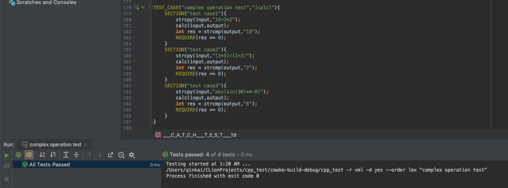

## 综合课程设计作业


### 概述

---

这是我在电子科技大学（UESTC）大三上学期做的综合课程设计第三期的作品。根据课程设计的要求，在第三期设计中，我们要完成以下任务

* 设计或移植一个操作系统
* 实现至少两个硬件的驱动
* 完成一个能与用户交互的软件的开发

因此我在选型时采用了较为熟悉的STM32，考虑到经费问题以及实际需求，我选用了f103vct6这块片子，但是当时完全没想到对内存的需求，导致后来设计的时候，256k的flash成为了一个限制开发的瓶颈。

然后是交互的部分，我认为如果要既简单又能体现出开发的难度，一块带触摸的LCD屏应该是最为合适的选择，并且触摸屏在与用户交互时也是一个非常自然的设备。

关于操作系统移植，我其实并没怎么对比，直接选用了简单的uC/OS II，虽然任务数有限制，但是内核小，而且对于这个简单的任务也不需要用到很多任务，所以没怎么思考就选择了移植。

关于用户界面，我经过仔细调查后发现相应的图形库其实并没有多少选择，不论是emWin还是STemWin还是uCGUI本质上其实都是segger公司的库，api和实现的功能方面也是大同小异，所以我直接选择了uCGUI3.95版本，因为uCGUI在4.0版本以后就不提供源码了，所以选择了这个“较新”的版本。

关于软件设计，在这方面我纠结了很久之后决定做一个计算器，实用性较高而且与用户交互也较为自然，唯一的难点就在代码的编写上。在这方面以前有过简单的计算器的编写经验，这次没花多久就把计算器的代码写完了。


### 代码文件构成

---

```
.
├── CMSIS
│   ├── core_cm3.c
│   ├── core_cm3.h
│   ├── startup
│   ├── startup_stm32f10x_hd.s
│   ├── stm32f10x.h
│   ├── system_stm32f10x.c
│   └── system_stm32f10x.h
├── FWlib
│   ├── inc
│   └── src
├── Output
├── PROJECT
├── README.md
├── Test
│   ├── CMakeLists.txt
│   ├── calculator.c
│   ├── calculator.h
│   ├── catch.hpp
│   ├── cmake-build-debug
│   ├── fpconv.c
│   ├── fpconv.h
│   ├── powers.h
│   ├── stack.c
│   ├── stack.h
│   ├── test_calc.cpp
│   ├── test_dtoa.cpp
│   └── test_main.cpp
├── code
│   ├── Calculator
│   ├── Font
│   ├── GUI
│   ├── PORTS
│   ├── SOURCE
│   ├── TFT
│   ├── UCOSII
│   ├── application
│   ├── driver
│   ├── header
│   ├── stm32f10x_it.c
│   ├── system
│   ├── uCGUI
│   └── user
├── listing
└── picture
    ├── calc_frame.jpg
    ├── start_frame.jpg
    └── test_result.png
```

CMSIS即微控制器软件接口标准(CMSIS：Cortex Microcontroller Software Interface Standard) 是 Cortex-M 处理器系列的与供应商无关的硬件抽象层。 使用CMSIS，可以为处理器和外设实现一致且简单的软件接口，从而简化软件的重用、缩短微控制器新开发人员的学习过程，并缩短新设备的上市时间。这部分代码由STM32官方提供。

FWlib即硬件固件库(FWlib: Firmware library)是由STM32官方提供的硬件库，包含上述inc文件夹中的.h文件以及src文件夹中的.c文件，主要用于存放STM32一些寄存器的定义，以及底层驱动函数。

Output文件夹中存放Keil5 在编译工程中产生的.o的目标文件以及 .d .crf的调试文件。

Listing文件夹中存放Keil5 在预编译后产生的文件。

Test文件夹主要用于存放代码测试所用到的源代码以及测试代码。

code文件夹用于存放本次工程编写的代码。文件构成如下

* Calculator文件夹用于存放计算器所涉及的代码
* Font文件夹用于存放自定义的字体代码
* GUI文件夹中的Config文件夹存放gui的配置，触摸屏gui的配置以及LCD的配置。为了节省编译时间，本次课程设计预编译了自己的库，所以GUI_inc文件夹需要存放本次工程所用到的函数的头文件。LCDDriver存放LCD的驱动文件。
* header文件夹中存放系统的头文件
* PORTS文件夹中存放uC/OS的接口文件
* SOURCE文件夹中存放uC/OS的核心代码文件
* system文件夹中存放STM32的启动文件
* TFT文件夹中存放LCD屏幕的api文件以及触摸屏的驱动和api
* uCGUI文件夹中存放uCGUI 3.95的所有源代码
* user文件夹中存放自定义的是stm32配置文件以及主函数入口和gui程序入口
* application文件夹中存放编写的app，包括计算器和更多信息页面的代码


### 操作系统移植

---

移植操作系统之前，我们需要先看一下uC/OS的代码构成，其构成如下


通过观察我们可以发现与硬件底层相关的只有图中标为**Cortex M3 Port**的部分，而另外**BSP**的部分我们可以直接舍弃，因为我代码中没有直接与硬件交互的部分，都是通过操作系统来调用底层硬件。在查找了许多网上的资料后，我大致总结了在STM32上移植uC/OS操作系统的几个要点。要点如下

1. 在os_cpu_a.asm中我们需要修改其中的PendSV_Handler，然后需要把stm32f10x_it.c中的PendSV_Handler注释掉

2. 需要根据板子上的晶振修改SysTick_Init()函数以及SysTick_Handler()函数

3. 修改os_cpu_c.c中的关于systick的配置初始化及中断处理部分

4. 注释掉os_cpu.h中以上修改过的函数部分


### 图形界面

---

在操作系统移植并测试完成后就涉及到了图形界面的设计，因为市场上已经有了非常成熟的图形库，所以我选择了移植图形库。在图形库的选择方面，市面上的图形库其实大同小异，比如ucgui，emwin，stemwin其实都是源于segger公司开发的同一个图形库，所以我选择了ucgui。并且由于ucgui在4.0版本后就不提供源代码了，而是以库文件的形式提供，所以在版本选择方面，我选择了3.95这个“较新”的版本。

在移植这个图形库时，对与源代码的改动主要集中在GUICon.h ,GUITouchConf.h,LCDConf.h,GUI_X.C,LCDNull.C这五个文件中。从文件名我们可以看出这五个文件分别对应了gui的配置，触摸屏的配置，lcd的配置，gui和操作系统之间的api以及lcd的相应api。详细改动如下

#### GUIConf.h

```c
#define GUI_OS                    (1)  /* 开启多任务支持 */
#define GUI_SUPPORT_TOUCH         (1)  /* 开启触摸支持 */
#define GUI_SUPPORT_UNICODE       (1)  /* 开启Unicode支持 */
#define GUI_TOUCH_AD_LEFT         290  /* 设置触屏最左侧的ad值 */
#define GUI_TOUCH_AD_RIGHT        3730 /* 设置触屏最右侧的ad值 */
#define GUI_TOUCH_AD_TOP          3850 /* 设置触屏最上侧的ad值 */
#define GUI_TOUCH_AD_BOTTOM       220  /* 设置触屏最下侧的ad值 */
#define GUI_DEFAULT_FONT          &GUI_Font8x16  /* 设置GUI默认字体为8*16 */  
#define GUI_ALLOC_SIZE            1024*5  /* 设置GUI可动态分配的内存大小 */
#define GUI_WINSUPPORT            1    /* 开启GUI的窗口支持 */
#define GUI_SUPPORT_MEMDEV        0    /* 因为没用sd卡，所以关闭内存设备支持 */
#define GUI_SUPPORT_AA            1    /* 开启抗锯齿 */
```


#### LCDConf.h

```c
#define LCD_XSIZE (400)       //配置TFT的水平分辨率
#define LCD_YSIZE (240)       //配置TFT的垂直分辨率
#define LCD_CONTROLLER (-2)   //TFT控制器的名称
#define LCD_BITSPERPIXEL (16) //每个像素的位数
#define LCD_FIXEDPALETTE (565)//调色板格式
#define LCD_SWAP_RB (0)       //红蓝反色交换
```


#### GUITouchConf.h

我并没有选择在这个文件中进行修改，因为打算把触摸屏所涉及到的函数放在同一个文件中进行编写。相对应的代码可以在  **TFT** 文件夹中找到，分别在 **touch.c** 和 **touch.h** 这两个文件中，我在这里简要介绍一下需要修改的宏定义

```c
#define GUI_TOUCH_SWAP_XY 0      //设置是否交换XY
#define GUI_TOUCH_MIRROR_X 0     //是否镜像X
#define GUI_TOUCH_MIRROR_Y 0     //是否镜像Y
#define GUI_TOUCH_AD_LEFT 3601   //触摸屏最左侧的AD值
#define GUI_TOUCH_AD_RIGHT 393   //触摸屏最右侧的AD值
#define GUI_TOUCH_AD_TOP 273     //触摸屏最上侧的AD值
#define GUI_TOUCH_AD_BOTTOM 3671 //触摸屏最下侧的AD值
```


#### GUI_X.c

需重写以下函数

```c
void GUI_X_Init(void)
int GUI_X_GetTime(void)
void GUI_X_Delay(int ms)
void GUI_X_Log (const char *s) { GUI_USE_PARA(s); }
void GUI_X_Warn (const char *s) { GUI_USE_PARA(s); }
void GUI_X_ErrorOut(const char *s) { GUI_USE_PARA(s); }
```


#### LCDNull.c

需根据硬件重写以下函数

 ```c
void LCD_L0_DrawPixel(int x, int y)
void LCD_L0_DrawHLine(int x0, int y, int x1)
void LCD_L0_DrawVLine(int x, int y0, int y1)
void LCD_L0_FillRect(int x0, int y0, int x1, int y1)
void LCD_L0_DrawBitmap(int x0, int y0,
                       int xsize, int ysize,
                       int BitsPerPixel,
                       int BytesPerLine,
                       const U8* pData, int Diff,
                       const LCD_PIXELINDEX* pTrans)
void LCD_L0_SetOrg(int x, int y)
int LCD_GetErrStat(void)
void LCD_ClrErrStat(void)
int LCD_GetErrCnt (void)
void LCD_Off(void) {}
void LCD_On(void) {}
int LCD_L0_Init(void)
int LCD_L0_CheckInit(void)
void LCD_L0_ReInit(void)
unsigned LCD_L0_GetPixelIndex(int x, int y)
void LCD_L0_XorPixel(int x, int y)
void LCD_L0_SetPixelIndex(int x, int y, int ColorIndex)
void * LCD_L0_GetDevFunc(int Index)
 ```

在修改了以上的代码后，图形界面就可以正常显示了。


### 计算器程序

---

本次的计算器程序分为两大部分，分别是图形界面以及表达式求值模块。

#### 图形界面

因为嵌入式平台的特殊性，如果不能提前获得图形界面样式，而靠一次次的烧录调试的话将会非常消耗时间。所以这次在制作图形界面时，我使用了seggar公司的GUIBuilder，依靠这个软件，我们可以先设计好相应的界面，然后在生成对应的c代码，节省了大量的时间。


#### 表达式求值模块

该模块对应的文件在**Calculation**文件夹中，本次课程设计最困难的地方也在这里。在这个计算器的设计中应用了编译原理的部分知识，以及一些c的小技巧。

##### 大致流程

首先输入的表达式将由词法分析函数分解成一个token序列（token之间的顺序将被保持），并同时检查词法是否合法。然后使用调度场算法将中缀表达式转换为后缀表达式（逆波兰表达式）。最后在操作符入后缀栈时直接进行计算。

##### 优点

* 使用调度场算法所带来的一个优点就是没有单独的求值步骤，每当操作符入栈时，前面被压入的表达式的值就会被计算。也就是说整个表达式被转换为后缀表达式的同时，后缀栈中就应该只剩下一个元素，也就是表达式的结果。这使得表达式是否存在问题非常容易得知（只要后缀表达式转换完毕，栈中元素数量不为1，就代表表达式本身存在问题），同时也使得求值的过程非常迅速。

##### A trick of C

在设计这个计算器所用的栈时，我决定将栈中的元素存储为**（void*）**类型，这就意味着栈上可以存储任意类型的元素，包括自定义的类型，也就是实现了一个 **Untyped Stack**。然后实现了栈的大部分操作。

##### 难点：浮点数转字符串函数 DTOA()

可能你会觉得奇怪，浮点数转字符串为什么会变成一个难点，因为最简单的sprintf就可以做到浮点数字符串的转换。很遗憾的是由于这次代码比较多，我不得不使用keil的microlib来缩小代码体积，而microlib中的sprintf函数没有实现浮点数转字符串的功能，任何浮点数的输出都会变成0.0。所以我必须自己实现一个足够精准的浮点数转字符串的函数。


### 测试

---

#### 功能测试

在这次的测试工作中，我没有选择老牌的测试框架，比如googletest，因为这样的测试框架太大了，有很多这次课程设计中我用不到的功能，比如mock什么的，而且移植起来也比较麻烦。所以我将目光投向了刚出了没多久的catch2，这是一个header-only的测试框架，只需要包含一个头文件就可以同时支持TDD和BDD。

本次所有测试的代码都可以在 **Test** 那个文件夹中找到。

##### 单元测试

###### 浮点数转字符串测试

* dota() random int input test (10000 times)


* dota() random double input test (10000 times)


###### 计算测试

* Calc simple expression test


* Calc special operation expression test


* Calc triangle function test


* Calc complex expression test



* Calc error or exception test


##### 集成测试


#### 内存泄漏测试

经过valgrind的多次测试，**整个**计算模块。包含计算函数，计算所用栈，浮点数字符串转换函数等**所有**存在手动malloc的函数在内，**没有发生任何内存泄漏**。篇幅有限，不能放出全部测试，其中两次测试如下：

- ```
  测试用例为： 2*3*(4+5)
  ```


- ```
  测试用例为： (abs(sin(30)*4-8)+3)/2-1
  ```


